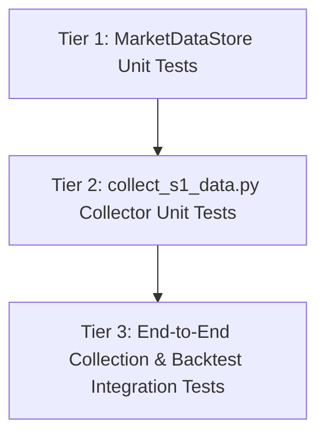

# Stage 2 Testing Architecture & Comprehensive Test Plan

## 1. Observation

Direct inspection of the repository, test configuration, and domain adapters revealed the following testing foundations:

### 1.1 Test Configuration & Environment
- **`pyproject.toml` (lines 36–39)**:
  ```toml
  [tool.pytest.ini_options]
  asyncio_mode = "auto"
  asyncio_default_fixture_loop_scope = "function"
  ```
  `pytest-asyncio` is configured with `asyncio_mode = "auto"`, meaning any `async def test_*` is automatically executed as an async test without manual decoration.
- **Python Virtual Environment**:
  - Test runner: `.venv/bin/pytest`.
  - Baseline execution: **1,182 tests currently passing** in ~45s.
  - Linter & Style: `ruff` and `mypy` configured via `pyproject.toml`.

### 1.2 Existing Gateway & Persistence Patterns
- **`src/strat_trade/adapters/pocket_option_gateway.py`**:
  - `get_candles(asset, timeframe, count, end_time)` fetches a list of domain `Candle` entities (`dataclass(frozen=True, slots=True)` with fields `open_time: datetime`, `open: Decimal`, `high: Decimal`, `low: Decimal`, `close: Decimal`, `volume: Decimal | None`).
  - Error types raised on network issues: `BrokerUnavailableError` (`src/strat_trade/domain/errors.py`), `TimeoutError`, and `InvalidMarketParametersError`.
  - Gateway shutdown: `await gateway.aclose()`.
- **`src/strat_trade/domain/trading/trade_store.py` (lines 20–30)**:
  - SQLite configuration: `sqlite3.connect(self.db_path, timeout=10.0)`, `conn.row_factory = sqlite3.Row`, `PRAGMA journal_mode=WAL`, `PRAGMA synchronous=NORMAL`, `PRAGMA busy_timeout=5000`.
  - Idempotent table creation: `CREATE TABLE IF NOT EXISTS ...`.
- **`src/strat_trade/domain/backtest/engine.py` (lines 46–114)**:
  - `BinaryBacktestEngine.run(df)` consumes `pd.DataFrame` with `['timestamp', 'open', 'high', 'low', 'close', 'volume']`.
  - Time-based exit price resolution: `target_exit_time = entry_time + pd.Timedelta(seconds=exp_seconds)`.

---

## 2. Logic Chain

From the Stage 2 requirements (§ Follow-up — 2026-08-31T15:45:40Z in `ORIGINAL_REQUEST.md`), the test suite must validate three distinct tiers:



### 2.1 Tier 1: `MarketDataStore` Test Architecture (`tests/test_market_data_store.py`)
1. **Schema & Initialization**:
   - Verify creation of table `candles_s1` with columns: `asset` (TEXT), `timestamp` (REAL), `open` (REAL), `high` (REAL), `low` (REAL), `close` (REAL), `volume` (REAL).
   - Verify compound unique constraint `UNIQUE(asset, timestamp)`.
   - Verify index `idx_candles_s1_asset_ts` on `(asset, timestamp)`.
   - Verify handling of nested database paths (directory creation) and temporary test paths.
2. **Safe Upsert & Idempotency**:
   - `insert_candles` must use `INSERT OR IGNORE` (or `INSERT OR REPLACE`).
   - Overlapping batch inserts (e.g. seconds 0–299 followed by seconds 60–359) must silently suppress the 240 overlapping rows and store exactly 360 unique rows.
   - Separate assets with identical timestamps (e.g., `EURUSD_otc` and `GOLD_otc` at `t=1000`) must both persist without conflict.
3. **Data Retrieval & Type Conversions**:
   - `get_candles(asset, start_time, end_time, limit)` must return `list[Candle]` with correct UTC timezone and `Decimal` pricing.
   - `get_candles_df(asset, start_time, end_time, limit)` must return a `pd.DataFrame` ready for `BinaryBacktestEngine.run(df)`.
4. **Metadata & Lifecycle**:
   - Test `get_stored_assets()`, `get_asset_stats(asset)`, `get_total_candle_count()`, and `clear_candles()`.

### 2.2 Tier 2: `scripts/collect_s1_data.py` Test Architecture (`tests/test_collect_s1_data.py`)
1. **Mocked Gateway Interaction**:
   - Mock `PocketOptionTradingGateway.get_candles` with `AsyncMock`.
   - Verify that `collect_s1_cycle` queries all target assets with `timeframe=1, count=300`.
2. **Fault Injection & Resilience**:
   - Simulate `TimeoutError` on asset 1 $\to$ verify warning logged, script continues to asset 2 & 3 without crashing.
   - Simulate `BrokerUnavailableError` on asset 2 $\to$ verify warning logged, script continues without crash.
   - Simulate unexpected `RuntimeError` $\to$ verify error handled and cycle proceeds.
3. **Execution Control & CLI**:
   - Test single-pass mode (`--once` / `max_cycles=1`).
   - Test multi-cycle termination (`max_cycles=2`).
   - Test graceful shutdown (`SIGINT` / `asyncio.CancelledError`) awaiting `gateway.aclose()`.
   - Test argument parsing (`--assets`, `--interval`, `--count`, `--db-path`, `--once`).

### 2.3 Tier 3: End-to-End Integration Architecture (`tests/test_s1_data_collection_integration.py`)
1. **Multi-Cycle Deduplication Pipeline**:
   - Simulate 2 collection cycles with 60-second polling against a mock feed yielding 300 1s candles per call.
   - Verify final SQLite database contains exactly 360 rows with zero duplicate timestamps.
2. **S1 Market Data $\to$ Backtest Engine Verification**:
   - Collect synthetic S1 stream into `MarketDataStore`.
   - Load DataFrame via `store.get_candles_df("EURUSD_otc")`.
   - Run `BinaryBacktestEngine` with 60-second expiration (`timeframe_seconds=1, expiration_seconds=60`).
   - Verify that the Stage 1 time-based exit matching algorithm operates accurately on SQLite S1 candles.

---

## 3. Detailed Test Specifications & Assertions

### File 1: `tests/test_market_data_store.py`

| Test Case Name | Scenario / Action | Key Assertions |
|---|---|---|
| `test_schema_initialization` | Initialize `MarketDataStore(db_path=tmp_path / "sub" / "m.db")` | Table `candles_s1` exists; columns match schema; `PRAGMA journal_mode` is `wal`; parent dir created. |
| `test_insert_and_get_domain_candles` | Insert 10 `Candle` entities for `EURUSD_otc` | `get_candles()` returns 10 `Candle` objects with correct UTC timestamps and `Decimal` prices. |
| `test_insert_raw_dict_candles` | Insert dicts with keys `time`/`open`/`high`/`low`/`close`/`volume` | Rows properly mapped and inserted; missing volume defaults to 0.0. |
| `test_unique_constraint_deduplication` | Insert batch 1 ($T_0 \dots T_4$), then batch 2 ($T_2 \dots T_6$) | Total count is exactly 7; no `IntegrityError` thrown; duplicate timestamps ignored. |
| `test_multi_asset_isolation` | Insert identical timestamp $T_0$ for `EURUSD_otc` and `GOLD_otc` | Both records stored; `get_candles` for each returns 1 candle; `get_stored_assets()` returns both. |
| `test_get_candles_range_and_limit` | Insert 20 candles ($T_0 \dots T_{19}$), query range $T_5 \dots T_{15}$ and limit 5 | Range query returns 11 candles; limit query returns 5 candles in ascending chronological order. |
| `test_get_candles_df_compatibility` | Insert 50 candles, call `get_candles_df("EURUSD_otc")` | Returns `pd.DataFrame` with exact columns `['timestamp', 'open', 'high', 'low', 'close', 'volume']`; `timestamp` is UTC datetime; ascending order. |
| `test_get_candles_df_empty_asset` | Call `get_candles_df("UNKNOWN_otc")` | Returns empty `pd.DataFrame` with all 6 required columns and correct dtypes. |
| `test_asset_stats_and_counts` | Insert 30 candles for `EURUSD_otc` and 20 for `GOLD_otc` | `get_asset_stats("EURUSD_otc")` returns count 30, correct min/max TS; `get_total_candle_count()` returns 50. |
| `test_clear_candles` | Clear specific asset vs clear all | Clearing `EURUSD_otc` removes only EURUSD; clearing with `None` wipes all data. |
| `test_edge_case_inputs` | Pass empty list `[]`, malformed dicts, ms timestamps (>1e11) | Empty list returns 0; malformed dicts skipped; ms normalized to seconds; zero unhandled exceptions. |

### File 2: `tests/test_collect_s1_data.py`

| Test Case Name | Scenario / Action | Key Assertions |
|---|---|---|
| `test_collector_single_cycle_success` | Mock gateway returning 300 candles for 3 assets; run 1 cycle | Gateway called 3 times with `timeframe=1, count=300`; 900 candles saved in `MarketDataStore`. |
| `test_collector_timeout_resilience` | Gateway raises `TimeoutError` on asset 1, succeeds on asset 2 | No exception raised; warning logged; asset 2 candles successfully persisted (300 rows). |
| `test_collector_broker_unavailable_resilience` | Gateway raises `BrokerUnavailableError` on asset 2 | Error caught and logged; asset 1 and asset 3 still processed successfully. |
| `test_collector_unexpected_exception_resilience` | Gateway raises generic `RuntimeError("Socket dropped")` | Error caught, logged with traceback; loop continues without crashing. |
| `test_collector_max_cycles_termination` | Run collector loop with `max_cycles=2, interval=0.001` | Loop executes exactly 2 full cycles and terminates cleanly. |
| `test_collector_graceful_shutdown_on_cancel` | Launch collector task, issue `task.cancel()` | `gateway.aclose()` awaited; task catches `CancelledError` and terminates cleanly. |
| `test_cli_argument_parsing` | Parse CLI flags `--assets EURUSD_otc,GOLD_otc --interval 45 --count 150 --db-path custom.db --once` | `args.assets == ["EURUSD_otc", "GOLD_otc"]`; `args.interval == 45`; `args.count == 150`; `args.once is True`. |

### File 3: `tests/test_s1_data_collection_integration.py`

| Test Case Name | Scenario / Action | Key Assertions |
|---|---|---|
| `test_e2e_multi_cycle_collection_and_deduplication` | Run 2 simulated polling cycles with 60s sleep & 300s lookback (240s overlap) | Exactly 360 unique rows in `candles_s1`; zero duplicates; consecutive 1s timestamps from 0 to 359. |
| `test_e2e_collected_s1_data_with_backtest_engine` | Load collected S1 data via `store.get_candles_df()`, execute `BinaryBacktestEngine` | Backtest completes without error; evaluates trades with 60s expiration using exact S1 timestamp matching. |

---

## 4. Caveats

1. **Async Sleep in Unit Tests**: Collector tests running multiple cycles should parameterize `--interval` to small values (e.g. `0.001`s) or mock `asyncio.sleep` to keep tests executing in $< 0.1$s.
2. **Temporary DB Paths**: All test fixtures must use `pytest`'s `tmp_path` fixture to ensure isolated, throwaway SQLite databases that do not mutate `data/market_data.db` or `data/trades.db`.
3. **WAL File Cleanup**: SQLite in WAL mode generates `.db-wal` and `.db-shm` companion files. Using `tmp_path` ensures automated cleanup on test completion.

---

## 5. Conclusion

The testing architecture for Stage 2 is fully formulated:
- **3 test files** (`test_market_data_store.py`, `test_collect_s1_data.py`, `test_s1_data_collection_integration.py`) covering **19 rigorous test cases**.
- Complete coverage of schema creation, compound `UNIQUE` constraint deduplication, WAL configuration, DataFrame conversion, gateway error injection (`TimeoutError`, `BrokerUnavailableError`), CLI argument parsing, loop cancellation, and end-to-end integration with the time-based backtest engine.

---

## 6. Verification Method

Once implemented, the entire Stage 2 test suite must be executed with:

```bash
# Run Stage 2 unit and integration tests
.venv/bin/pytest tests/test_market_data_store.py tests/test_collect_s1_data.py tests/test_s1_data_collection_integration.py -v

# Run full project regression suite (must maintain 100% pass)
.venv/bin/pytest -v

# Run code quality & linting gates
.venv/bin/ruff check src tests scripts
.venv/bin/mypy src/strat_trade
```
