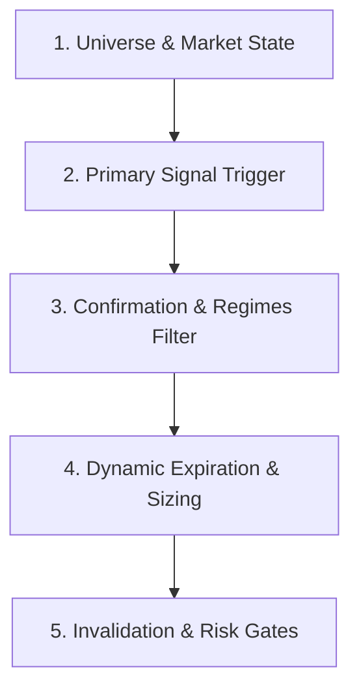
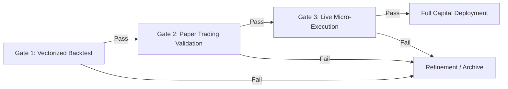
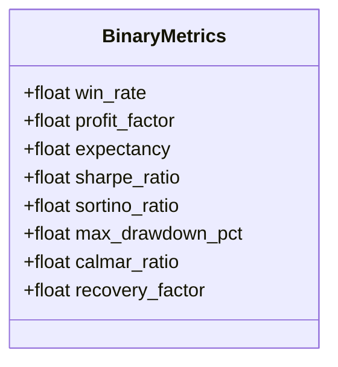
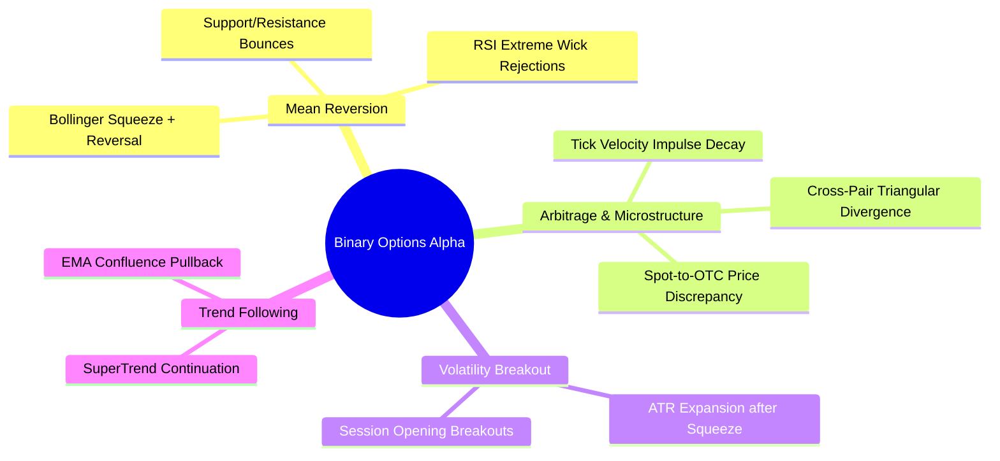
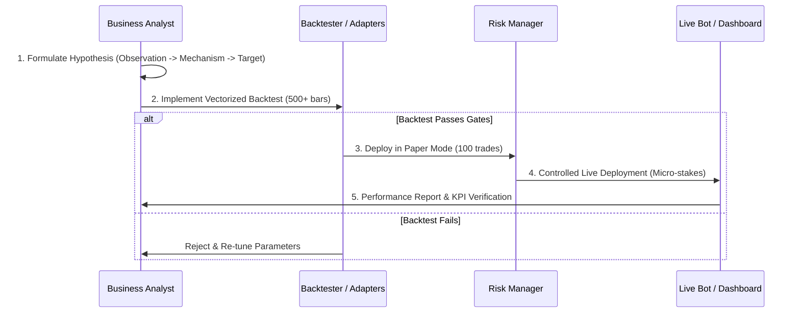
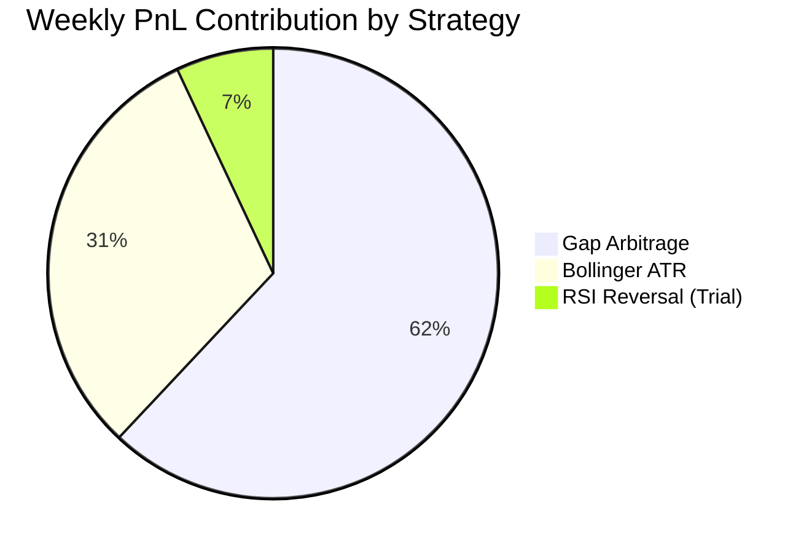
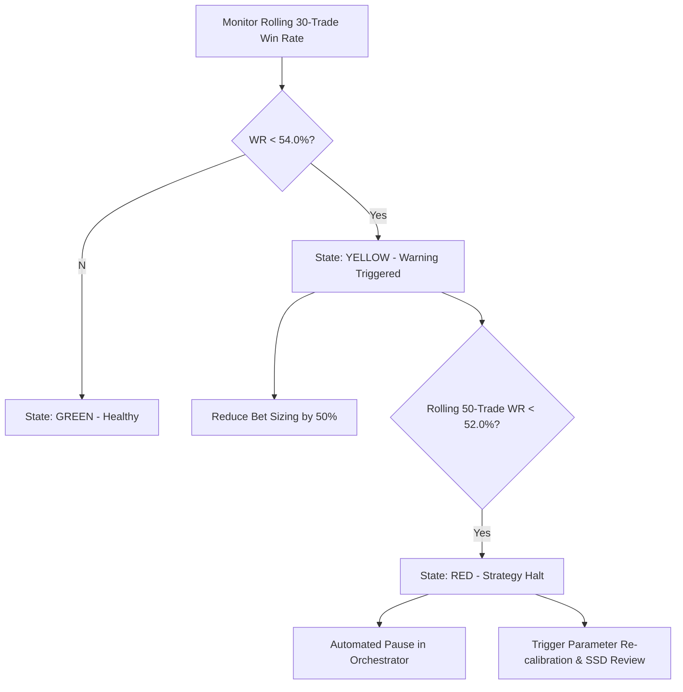
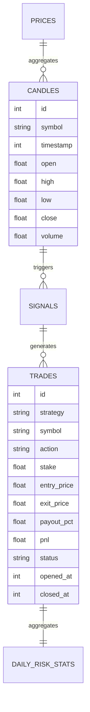
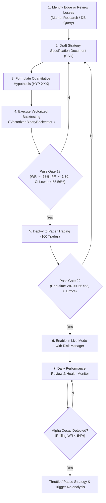

# Business Analyst Skill: Quantitative Requirements & Performance Analytics

## 1. Project Context & Philosophy

The **Pocket Option AutoTrader Pro** is an autonomous asynchronous FastAPI trading system designed for binary options execution on Pocket Option.

### System Architecture Reference
- `app/strategies/base.py` — `BaseStrategy` abstract base class (`evaluate_candles()`, `on_tick()`, `get_parameters()`, `set_parameters()`)
- `app/strategies/orchestrator.py` — `StrategyOrchestrator` singleton managing `CandleAggregator`, signal routing, and execution
- `app/strategies/gap_arbitrage.py` — Spot-to-OTC Price Gap Arbitrage (Rolling Z-Score on spread)
- `app/strategies/bollinger_atr.py` — Bollinger Bands (20, 2.0) + ATR(14) Mean-Reversion
- `app/services/risk/manager.py` — `RiskManager` with dynamic bet sizing (0.5%–2.0%), daily stop-loss (5%), cooldown (60s), payout filter (>=75%)
- `app/services/backtester/engine.py` & `adapters.py` — `BacktestEngine` and `VectorizedBinaryBacktester`
- `app/services/pocket_option/client.py` — Asynchronous Engine.IO WebSocket client
- `app/core/config.py` — Pydantic system settings and strategy hyperparameters
- `app/db/models.py` — SQLite async WAL models: `candles`, `prices`, `signals`, `trades`, `daily_risk_stats`
- `app/api/v1/endpoints/` — REST API endpoints (`/bot`, `/trades`, `/risk`, `/strategies`, `/backtest`, `/market`)

### Canonical Signal Payload
```python
{
    "strategy": "bollinger_atr",
    "symbol": "EURUSD_otc",
    "action": "CALL",          # "CALL" | "PUT"
    "price": 1.08652,
    "confidence": 0.85,        # 0.0 - 1.0 (scales bet sizing in RiskManager)
    "expiration_seconds": 180, # Default: 180s (3 bars on M1)
    "metadata": {
        "bb_low": 1.08640,
        "atr": 0.00018,
        "atr_sma": 0.00015,
        "z_score": -2.45
    }
}
```

### Core Business Philosophy
- **Profit-Driven Evolution**: We operate strictly for sustained net profitability. Every loss is recorded, categorized, and fed into strategy refinement.
- **Parametric Agility**: We fearlessly tune indicator parameters, math models, timeframes, and expiration windows to adapt to regime shifts.
- **Independent Alpha**: We do not copy generic internet indicators blindly; we synthesize unique mathematical edges (e.g., synthetic OTC vs. Spot Z-score dispersion, volatility squeeze filters).
- **Mandatory Quantitative Validation**: No strategy or parameter alteration enters live trading without passing rigorous vectorized backtesting and statistical significance hurdles.
- **Adaptive Lifecycle**: Strategies that experience alpha decay or structural edge breakdown are automatically throttled, recalibrated, or retired.

---

## 2. Requirements Engineering for Binary Options Strategies

Binary options trading requires deterministic, non-ambiguous requirements because outcomes are binary (all-or-nothing payout vs. full loss of stake) within a fixed time horizon ($T_{exp}$).

### 2.1 Strategy Formalization Framework

Every strategy requirement must specify 5 core modules:



1. **Universe & Market State Filter**:
   - Target assets: Specific currency pairs (e.g., `EURUSD_otc`, `GBPUSD_otc`, `USDJPY_otc`).
   - Market regime condition: Trending (ADX > 25), Ranging (ADX < 20, BB bandwidth < threshold), or High Volatility (ATR expansion).
   - Minimum Broker Payout: Minimum acceptable payout (default: >= 80%, hard floor >= 75%).
2. **Primary Signal Trigger**:
   - Exact mathematical condition evaluated on closed candles (`M1`) or tick streams.
   - Clear distinction between CALL (buy) and PUT (sell) trigger formulas.
3. **Confirmation & Invalidation Filters**:
   - Secondary indicators (e.g., RSI divergence, Volume/Tick velocity threshold, MA alignment).
   - Invalidation rules: Spread spike, news blackout, high ATR explosion factor ($ATR / ATR_{SMA} > 2.5$).
4. **Expiration Time Optimization**:
   - Exact expiration duration in seconds ($60s, 180s, 300s$).
   - Rule for mapping candle timeframe to expiration: $N_{bars} = \frac{T_{exp}}{Timeframe}$.
5. **Confidence Rating & Sizing Rules**:
   - Deterministic formula for `confidence` $\in [0.0, 1.0]$ based on signal strength, distance from mean, or multi-indicator confluence.

---

### 2.2 Strategy Specification Document (SSD) Template

```markdown
# Strategy Specification Document (SSD): [STRAT-003] RSI-Momentum Pullback

## 1. Metadata
- **Strategy ID**: STRAT-003
- **Author**: Business Analyst
- **Created Date**: 2026-08-19
- **Status**: Ready for Backtest
- **Target Assets**: EURUSD_otc, GBPUSD_otc, USDJPY_otc
- **Base Timeframe**: M1 (60s)
- **Target Expiration**: 180s (3 bars)

## 2. Business Objective & Edge Hypothesis
- **Hypothesis**: In OTC markets during range-bound regimes, when M1 RSI(14) enters deep overbought/oversold (>75 or <25) with a rejection wick > 35% of candle body, a 3-minute mean-reversion trade will achieve >= 62% win rate due to micro liquidity provider mean-reversion clamping.
- **Target Win Rate**: >= 60.0%
- **Target Profit Factor**: >= 1.35
- **Expected Trade Frequency**: 4-8 trades / hour / pair

## 3. Mathematical Indicators & Parameters
| Parameter Name | Type | Default Value | Optimization Range | Description |
|---|---|---|---|---|
| `rsi_period` | int | 14 | 7 - 21 (step 1) | RSI lookback length |
| `rsi_oversold` | float | 25.0 | 20.0 - 30.0 | CALL trigger boundary |
| `rsi_overbought`| float | 75.0 | 70.0 - 80.0 | PUT trigger boundary |
| `min_wick_ratio`| float | 0.35 | 0.20 - 0.50 | Lower/Upper wick to body ratio |
| `ema_trend_filter`| int | 200 | 100 - 300 | Trend direction anchor |
| `expiration_bars`| int | 3 | 1 - 5 | Expiration multiplier |

## 4. Entry Logic
### CALL (BUY) Rules:
1. `EMA_200` trend alignment: `close[t-1] >= EMA_200[t-1]` OR range condition (`ADX(14) < 22`).
2. `RSI(14)[t-1] <= 25.0`.
3. Rejection Wick: `(min(open[t-1], close[t-1]) - low[t-1]) / (high[t-1] - low[t-1]) >= 0.35`.
4. Bullish confirmation: `close[t] >= open[t]`.
5. Confidence score: `min(1.0, 0.5 + (25.0 - RSI) * 0.03 + wick_ratio * 0.5)`.

### PUT (SELL) Rules:
1. `EMA_200` trend alignment: `close[t-1] <= EMA_200[t-1]` OR range condition (`ADX(14) < 22`).
2. `RSI(14)[t-1] >= 75.0`.
3. Rejection Wick: `(high[t-1] - max(open[t-1], close[t-1])) / (high[t-1] - low[t-1]) >= 0.35`.
4. Bearish confirmation: `close[t] <= open[t]`.
5. Confidence score: `min(1.0, 0.5 + (RSI - 75.0) * 0.03 + wick_ratio * 0.5)`.

## 5. Risk & Invalidation Filters
- Reject if broker payout < 80%.
- Reject if `ATR(14) / ATR_SMA(30) > 2.2` (Abnormal volatility spike).
- Reject if cooldown < 60s from last trade on same symbol.

## 6. Output Signal Format
```json
{
  "strategy": "rsi_momentum_pullback",
  "symbol": "EURUSD_otc",
  "action": "CALL",
  "price": 1.08450,
  "confidence": 0.78,
  "expiration_seconds": 180,
  "metadata": {
    "rsi": 22.4,
    "wick_ratio": 0.42,
    "ema_200": 1.08410
  }
}
```
```

---

### 2.3 Acceptance Criteria & Go-Live Gates

A strategy MUST pass a 3-Stage Gate before live capital deployment:



| Quality Gate | Minimum Sample | Required Metrics | Pass Condition |
|---|---|---|---|
| **Gate 1: Vectorized Backtesting** | >= 500 simulated trades on real/synthetic M1 data | • Win Rate $\ge 58.0\%$ (at 80% payout)<br>• Profit Factor $\ge 1.30$<br>• Max Drawdown $\le 12.0\%$<br>• Sharpe Ratio $\ge 1.50$ | Meets all metrics across in-sample AND out-of-sample datasets |
| **Gate 2: Paper (Dry-Run) Execution** | >= 100 live WebSocket trades | • Win Rate $\ge 56.5\%$<br>• Zero execution timeout errors<br>• Payout filter compliance = 100% | Real-time performance matches backtest within $95\%$ confidence interval |
| **Gate 3: Live Micro-Allocation** | >= 50 live trades ($1-$5 stake) | • Slippage $\le 0.5$ pips<br>• Actual broker payout matching<br>• Daily Stop-Loss not triggered | Realized net PnL positive, execution latency $< 350ms$ |

---

## 3. Quantitative Comparative Analysis Framework

Binary options have asymmetrical payout mechanics. Unlike Forex/Equity trading with variable risk-to-reward ratios, binary options have a fixed loss (100% of bet) and a capped profit (typically 75%–92% of bet).

### 3.1 Mathematical Metrics for Binary Options



1. **Win Rate ($WR$)**:
   $$WR = \frac{N_{wins}}{N_{total}} \times 100\%$$
   *Binary Options Breakeven Hurdle ($P$ = payout % as decimal, e.g., 0.80)*:
   $$WR_{breakeven} = \frac{1}{1 + P} = \frac{1}{1 + 0.80} = 55.56\%$$
   *At 85% payout*: $WR_{BE} = 54.05\%$. *At 75% payout*: $WR_{BE} = 57.14\%$.

2. **Profit Factor ($PF$)**:
   $$PF = \frac{\text{Gross Profit}}{\text{Gross Loss}} = \frac{\sum \text{pnl}_{\text{won}}}{\sum |\text{pnl}_{\text{lost}}|}$$
   - $PF < 1.0$: Guaranteed account depletion.
   - $1.0 \le PF < 1.25$: Marginally profitable (vulnerable to payout dips).
   - $PF \ge 1.35$: Solid production edge.

3. **Binary Options Mathematical Expectancy ($EV$)**:
   Expected dollar return per $1.00 risked:
   $$EV = (WR \times P) - ((1 - WR - TieRate) \times 1.0)$$
   *Example*: With $WR = 60\%$, $Payout = 80\%$, $TieRate = 2\%$, $LossRate = 38\%$:
   $$EV = (0.60 \times 0.80) - (0.38 \times 1.0) = 0.48 - 0.38 = +0.10 \text{ per dollar staked (+10.0% ROI/trade)}$$

4. **Sharpe Ratio (Trade-level Binary Formulation)**:
   $$\text{Sharpe} = \frac{\mu_{returns}}{\sigma_{returns}} \times \sqrt{N_{trades\_per\_year}}$$
   Where return per trade $R_i \in \{+P, 0, -1.0\}$.

5. **Sortino Ratio (Downside Deviation Focus)**:
   $$\text{Sortino} = \frac{\mu_{returns}}{\sqrt{\frac{1}{N_{losses}} \sum (R_{\text{loss}})^2}} \times \sqrt{N_{trades\_per\_year}}$$

6. **Maximum Drawdown ($MDD$) & Max Drawdown Duration**:
   $$MDD_{\%} = \max_{t \in [0, T]} \left( \frac{\text{Peak}_t - \text{Balance}_t}{\text{Peak}_t} \right) \times 100\%$$

7. **Calmar Ratio & Recovery Factor**:
   $$\text{Calmar} = \frac{\text{Annualized Net Return } \%}{MDD_{\%}}, \quad \text{Recovery Factor} = \frac{\text{Total Net PnL}}{MDD_{\$}} $$

---

### 3.2 Binary Options Payout vs. Win Rate Sensitivity Matrix

| Payout % | Breakeven WR | Target WR (PF = 1.20) | Target WR (PF = 1.40) | Target WR (PF = 1.60) | EV per $100 bet at 60% WR |
|---|---|---|---|---|---|
| **70%** | 58.82% | 63.16% | 66.67% | 69.57% | +$2.00 |
| **75%** | 57.14% | 61.54% | 65.12% | 68.09% | +$5.00 |
| **80%** | 55.56% | 60.00% | 63.64% | 66.67% | +$8.00 |
| **85%** | 54.05% | 58.54% | 62.22% | 65.26% | +$11.00 |
| **90%** | 52.63% | 57.14% | 60.87% | 63.93% | +$14.00 |
| **92%** | 52.08% | 56.60% | 60.34% | 63.41% | +$15.20 |

> [!IMPORTANT]
> **BA Rule**: Never allow live execution on assets with payout $< 75\%$. A strategy with 57% win rate is highly profitable at 90% payout ($+5.7\%$ EV) but loses money at 70% payout ($-3.1\%$ EV).

---

### 3.3 Statistical Significance & Confidence Intervals

When analyzing backtest results or live trading batches, sample size $n$ determines whether results are genuine skill or random luck.

#### 1. Minimum Sample Size Rule
To verify with 95% confidence ($\alpha = 0.05$) that an observed win rate $\hat{p}$ is statistically superior to the breakeven threshold $p_0 = 0.5556$:
$$n \ge \frac{(Z_{\alpha/2} \sqrt{p_0(1-p_0)} + Z_{\beta} \sqrt{\hat{p}(1-\hat{p})})^2}{(\hat{p} - p_0)^2}$$
- If expected $\hat{p} = 60\%$ ($0.60$) vs $p_0 = 55.56\%$: Minimum required sample size $n \approx 380$ trades.
- If expected $\hat{p} = 65\%$ ($0.65$) vs $p_0 = 55.56\%$: Minimum required sample size $n \approx 95$ trades.

#### 2. Wilson Score Interval for Binomial Confidence
For $n$ trades with $w$ wins ($\hat{p} = w/n$) at $95\%$ confidence ($z = 1.96$):
$$CI_{95\%} = \frac{\hat{p} + \frac{z^2}{2n} \pm z \sqrt{\frac{\hat{p}(1-\hat{p})}{n} + \frac{z^2}{4n^2}}}{1 + \frac{z^2}{n}}$$

If the **lower bound** of $CI_{95\%}$ is $> WR_{breakeven}$, the strategy has proven statistical alpha.

---

### 3.4 Strategy Comparison Report Template

```markdown
# Strategy Benchmark & Comparison Report
**Date**: 2026-08-19 | **Dataset**: 1,200 M1 Bars (EURUSD_otc) | **Payout**: 80.0%

| Strategy Name | Trades | Wins | Losses | Win Rate | 95% CI Lower | Profit Factor | Net PnL ($1000 base) | Max DD % | Sharpe | Status |
|---|---|---|---|---|---|---|---|---|---|---|
| **Spot-to-OTC Gap Arbitrage** | 142 | 92 | 50 | **64.79%** | 56.65% | **1.47** | +$236.00 (+23.6%) | 4.80% | 2.14 | **ACTIVE / PRIORITY** |
| **Bollinger + ATR Mean-Rev** | 210 | 128 | 82 | **60.95%** | 54.25% | **1.25** | +$204.00 (+20.4%) | 7.20% | 1.62 | **ACTIVE** |
| **MACD Trend Pullback** | 185 | 98 | 87 | **52.97%** | 45.80% | **0.90** | -$86.00 (-8.6%) | 14.50% | -0.42 | **REJECTED** |
| **RSI-Momentum (Proposed)** | 160 | 101 | 59 | **63.13%** | 55.40% | **1.37** | +$218.00 (+21.8%) | 5.90% | 1.88 | **CANDIDATE** |
```

---

## 4. Market Research & Binary Options Dynamics

### 4.1 Comparative Strategy Archetypes



1. **Mean Reversion (High WR: 60%–68%, Best on M1/M3 OTC)**:
   - Exploits temporary exhaustion and reversion to rolling mean.
   - Ideal for ranging OTC market algorithms that enforce mean-reverting stochastic processes.
2. **Spot-to-OTC Price Gap Arbitrage (High WR: 62%–72%, Best during active Forex sessions)**:
   - Pocket Option OTC synthetic feeds occasionally lag or temporarily decouple from true interbank Spot feeds.
   - When Z-score deviation exceeds $2.0\sigma$, mean convergence within 180s has high statistical probability.
3. **Momentum & Trend Breakouts (Moderate WR: 52%–57%, Lower Edge for Binary)**:
   - Trend strategies suffer in binary options due to pullback noise within fixed expiration times. Requires longer expirations (5–15 min).

---

### 4.2 OTC (Over-The-Counter) vs. Spot Market Structural Realities

Understanding OTC mechanics is vital for business modeling on Pocket Option:

| Dimension | Interbank Spot Forex (EURUSD) | Pocket Option OTC (EURUSD_otc) | Strategic Implication |
|---|---|---|---|
| **Pricing Engine** | Real interbank liquidity aggregation | Broker-generated algorithmic/synthetic feed | OTC feeds exhibit higher mean-reverting behavior on M1 |
| **Trading Hours** | 24/5 (Mon 00:00 - Fri 22:00 UTC) | 24/7 (Including weekends & holidays) | OTC is tradeable continuously; weekend spreads widen |
| **Spread & Noise** | Variable market spreads (0.2–1.5 pips) | Zero explicit spread, embedded pricing buffer | Great for fixed expiration entry without spread cost |
| **Wick Frequency** | Driven by real bank order blocks & news | Algorithmic stochastic volatility generation | Rejection wick strategies excel on OTC pairs |
| **Broker Payout** | N/A (Leveraged CFD/Spot) | 70% to 92% depending on pair & liquidity | Payout must be continuously polled via WebSocket |

---

### 4.3 Asset, Timeframe, & Session Profitability Heatmap

```mermaid
gantt
    title Global Trading Sessions & OTC Profitability Windows (UTC)
    dateFormat HH:mm
    axisFormat %H:%M
    section Sessions
    Asian Session (Tokyo/Sydney)       :00:00, 08:00
    European Session (London)         :07:00, 16:00
    American Session (New York)       :12:00, 21:00
    London-NY Overlap (Peak Volatility):12:00, 16:00
    OTC Weekend Cycle (Synthetic Edge):00:00, 24:00
```



#### Session Performance Profile for Binary Options:
1. **London / New York Overlap (12:00 – 16:00 UTC)**:
   - **Best for**: Spot-to-OTC Gap Arbitrage, Volatility Breakout.
   - **Characteristics**: Highest Spot liquidity, rapid price discovery, OTC tracking divergence creates arbitrage opportunities.
2. **Asian Session / Late NY (21:00 – 06:00 UTC)**:
   - **Best for**: Bollinger + ATR Mean-Reversion, RSI Wick Rejection.
   - **Characteristics**: Low macroeconomic noise, smooth channel consolidation, 62%+ mean-reversion win rates.
3. **OTC Weekend Trading (Saturday – Sunday)**:
   - **Best for**: Synthetic OTC Mean Reversion (`EURUSD_otc`, `GBPUSD_otc`, `BTCUSD_otc`).
   - **Characteristics**: High platform payouts (often 85%–92%), purely algorithmic volatility, zero unexpected geopolitical news shocks.

---

## 5. Hypothesis Generation & Scientific Lifecycle

Every trading modification starts as a testable, falsifiable quantitative hypothesis.

### 5.1 The 5-Step Hypothesis Engineering Framework



### 5.2 Concrete Production Hypotheses

#### Hypothesis HYP-2026-01: Multi-Timeframe Trend-Filtered Mean Reversion
- **Observation**: Bollinger band mean-reversion signals on M1 suffer consecutive losses during strong M5/M15 trend runs.
- **Mechanism**: Counter-trend entries get run over when higher-timeframe momentum is dominant.
- **Falsifiable Statement**: *"Adding an M5 EMA(50) slope filter to `bollinger_atr.py` (only CALL when price > M5 EMA_50, only PUT when price < M5 EMA_50) will reduce trade frequency by 25% but increase Win Rate on `EURUSD_otc` from 60.5% to >= 64.5% over a 1,000-candle sample."*

#### Hypothesis HYP-2026-02: Asymmetric Z-Score Thresholds for Spot-to-OTC Arbitrage
- **Observation**: `EURUSD_otc` exhibits an upward drift bias during Asian trading sessions.
- **Mechanism**: Algorithmic OTC market-making skew.
- **Falsifiable Statement**: *"Setting asymmetric Z-score triggers ($Z_{CALL} = -1.8, Z_{PUT} = 2.4$) during 22:00-06:00 UTC will yield a Win Rate >= 66.0% compared to symmetric $\pm 2.0$ triggers (61.0%)."*

---

### 5.3 Hypothesis Tracking Board Template

```markdown
# Quantitative Hypothesis Backlog & Audit Log

| Hypothesis ID | Title | Strategy Target | Target Asset | Hypothesized WR | Backtest WR | Live WR | Status |
|---|---|---|---|---|---|---|---|
| **HYP-01** | Spot-OTC Z-Score 2.0 Entry | `gap_arbitrage` | EURUSD / EURUSD_otc | $\ge 62\%$ | **64.8%** | **63.5%** | **LIVE DEPLOYED** |
| **HYP-02** | ATR Max Squeeze Factor 2.5 | `bollinger_atr` | All OTC Pairs | $\ge 59\%$ | **61.2%** | **60.1%** | **LIVE DEPLOYED** |
| **HYP-03** | M5 Trend Filter on M1 Entries | `bollinger_atr` | GBPUSD_otc | $\ge 64\%$ | **65.1%** | -- | **PAPER TESTING** |
| **HYP-04** | Volume Tick Velocity Spike Filter | `rsi_wick` | USDJPY_otc | $\ge 61\%$ | **54.2%** | -- | **REJECTED (Failed G1)**|
| **HYP-05** | Weekend Crypto OTC Mean-Rev | `bollinger_atr` | BTCUSD_otc | $\ge 60\%$ | **62.7%** | -- | **QUEUED FOR G2** |
```

---

## 6. Performance Reporting & Strategy Health Monitoring

### 6.1 Daily Performance Report Template

```markdown
# Pocket Option AutoTrader Pro — Daily Performance Report
**Date**: 2026-08-19 | **Environment**: LIVE | **Starting Balance**: $1,000.00 | **Ending Balance**: $1,142.50

### 1. Executive Summary
- **Net Daily PnL**: +$142.50 (+14.25%)
- **Total Trades Executed**: 24
- **Wins**: 16 | **Losses**: 8 | **Ties**: 0
- **Daily Win Rate**: **66.67%** (Breakeven: 55.56%)
- **Profit Factor**: **1.60**
- **Max Intraday Drawdown**: $38.00 (3.65%)
- **Risk Halt Triggered**: NO (Daily Stop-Loss limit: 5.0%)

### 2. Strategy Breakdown
| Strategy | Trades | Wins | Losses | Win Rate | PnL ($) | Avg Bet ($) | Avg Payout |
|---|---|---|---|---|---|---|---|
| `gap_arbitrage` | 14 | 10 | 4 | **71.43%** | +$104.00 | $15.00 | 85.0% |
| `bollinger_atr` | 10 | 6 | 4 | **60.00%** | +$38.50 | $12.50 | 82.0% |

### 3. Pair Performance
| Symbol | Trades | Wins | Losses | Win Rate | Net PnL | Status |
|---|---|---|---|---|---|---|
| `EURUSD_otc` | 12 | 9 | 3 | **75.00%** | +$87.00 | Excellent Alpha |
| `GBPUSD_otc` | 8 | 5 | 3 | **62.50%** | +$34.50 | Nominal |
| `USDJPY_otc` | 4 | 2 | 2 | **50.00%** | +$21.00 | Under Review (Small Sample) |

### 4. Incidents & Anomalies
- 08:14 UTC: Payout dropped to 72% on `USDJPY_otc` — RiskManager successfully filtered out 2 signals.
- WebSocket Latency: Average 124ms round-trip (Engine.IO keepalive OK).

### 5. Action Items for Tomorrow
1. Increase `gap_arbitrage` allocation weight to 65% of max bet capacity.
2. Review `USDJPY_otc` spread volatility during Asian open.
```

---

### 6.2 Weekly Executive KPI Dashboard Specification

The weekly review consolidates performance across multi-day cycles to evaluate capital growth velocity and risk metrics:



#### Key Weekly Tracking Metrics:
- **Cumulative Weekly ROI**: Target $\ge +15.0\%$ / week.
- **Weekly Profit Factor**: Target $\ge 1.40$.
- **Win Rate Distribution**: Rolling 50-trade win rate chart to detect volatility clustering.
- **Risk Compliance**: $0$ violations of daily 5% stop-loss halt.
- **Signal Quality Ratio**: $\frac{\text{Signals Executed}}{\text{Total Signals Generated}}$ (Measures risk filter rejection rate).

---

### 6.3 Strategy Degradation & Alpha Decay Early Warning System

Strategies degrade as market conditions shift. The BA uses a strict decay monitoring protocol:



#### Degradation Trigger Matrix:
- **Green (Optimal)**: Rolling 30-trade WR $\ge 58.0\%$. Full bet allocation (0.5%–2.0%).
- **Yellow (Review)**: Rolling 30-trade WR between $54.0\%$ and $57.9\%$. Bet size clamped to 0.5% minimum.
- **Red (Degraded / Halted)**: Rolling 30-trade WR $< 54.0\%$ OR Profit Factor $< 1.05$. Bot automatically disables strategy symbol in `StrategyOrchestrator`.

---

## 7. Deep-Dive Data Analysis & Session Analytics

### 7.1 Telemetry Data Architecture

To conduct actionable post-trade analysis, the BA tracks and queries the following database tables (`app/db/models.py`):



### 7.2 Post-Trade Pattern Recognition Playbook

When analyzing loss clusters in the database, look for these 4 recurring failure patterns:

1. **Streak Clustering (Martingale Trap)**:
   - *Pattern*: 3+ consecutive losses occurring within a 15-minute window.
   - *Root Cause*: Sudden macroeconomic breakout overriding mean-reversion indicators.
   - *Remedy*: Ensure `RiskManager` enforces a minimum 60s cooldown per pair and a consecutive-loss cooldown (10 minutes pause after 3 consecutive losses).
2. **Wick Squeeze / Expiration Mismatch**:
   - *Pattern*: Price moves in predicted direction at $t = 60s$ and $t = 120s$, but retraces at exactly $t = 180s$.
   - *Root Cause*: Expiration duration too long for micro-scalping volatility.
   - *Remedy*: Run parameterized backtests comparing $T_{exp} = 60s, 120s, 180s, 300s$ on `VectorizedBinaryBacktester`.
3. **Payout Compression Arbitrage**:
   - *Pattern*: High win rate (65%) but stagnant balance growth.
   - *Root Cause*: Trades executed during low payout hours (e.g., 70%–75%).
   - *Remedy*: Raise `min_payout_percent` in `app/core/config.py` from 75% to 80%.
4. **Execution Delay & Micro-Slippage**:
   - *Pattern*: Signal price vs. broker entry price discrepancy $> 1.0$ pip.
   - *Root Cause*: WebSocket serialization delay or network lag.
   - *Remedy*: Flag latency $> 250ms$ in `client.py` logs for network optimization.

---

### 7.3 Session-Based Hourly Analysis Template

```markdown
### Hourly Performance Breakdown (Aggregated 30-Day Sample)
| Hour (UTC) | Dominant Session | Trades | Wins | Losses | Win Rate | Expected Value ($/trade) | Recommendation |
|---|---|---|---|---|---|---|---|
| **00:00 - 04:00** | Asian (Tokyo) | 120 | 79 | 41 | **65.83%** | +$18.50 | **Prime Mean-Reversion Window** |
| **04:00 - 07:00** | Asian-European Gap | 65 | 36 | 29 | **55.38%** | -$0.30 | **Reduce Trading / Cooldown** |
| **07:00 - 11:00** | London Morning | 145 | 86 | 59 | **59.31%** | +$6.80 | **Active Trend & Gap Trading** |
| **12:00 - 16:00** | London/NY Overlap | 210 | 141 | 69 | **67.14%** | +$20.80 | **Peak Gap Arbitrage Volume** |
| **16:00 - 20:00** | NY Afternoon | 110 | 64 | 46 | **58.18%** | +$4.70 | **Standard Operation** |
| **20:00 - 24:00** | NY Close / Asian Open| 85 | 53 | 32 | **62.35%** | +$12.20 | **Mean-Reversion Active** |
```

---

## 8. Business Analyst Standard Operating Procedure (SOP)

Follow this end-to-end workflow when creating, optimizing, or evaluating any trading strategy:



### Business Analyst Operational Checklist
- [ ] Has the strategy specification document (SSD) formalized all entry, exit, filter, and expiration parameters?
- [ ] Is the mathematical breakeven hurdle rate ($WR_{BE}$) computed for the target asset's actual payout?
- [ ] Did the backtest contain at least 400–500 bars to guarantee 95% statistical confidence?
- [ ] Is the lower bound of the Wilson 95% Confidence Interval strictly greater than the broker breakeven rate?
- [ ] Does the `RiskManager` enforce dynamic bet sizing ($0.5\% - 2.0\%$), daily stop-loss ($5\%$), and cooldown ($60s$)?
- [ ] Are daily and weekly performance reports systematically recording PnL, Win Rate, and Strategy Health states?
